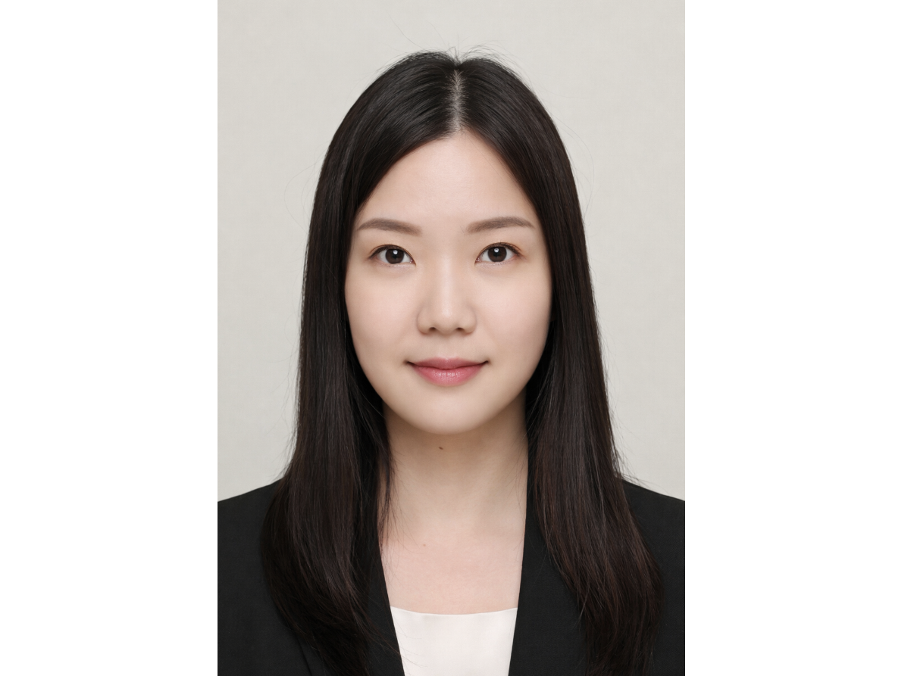
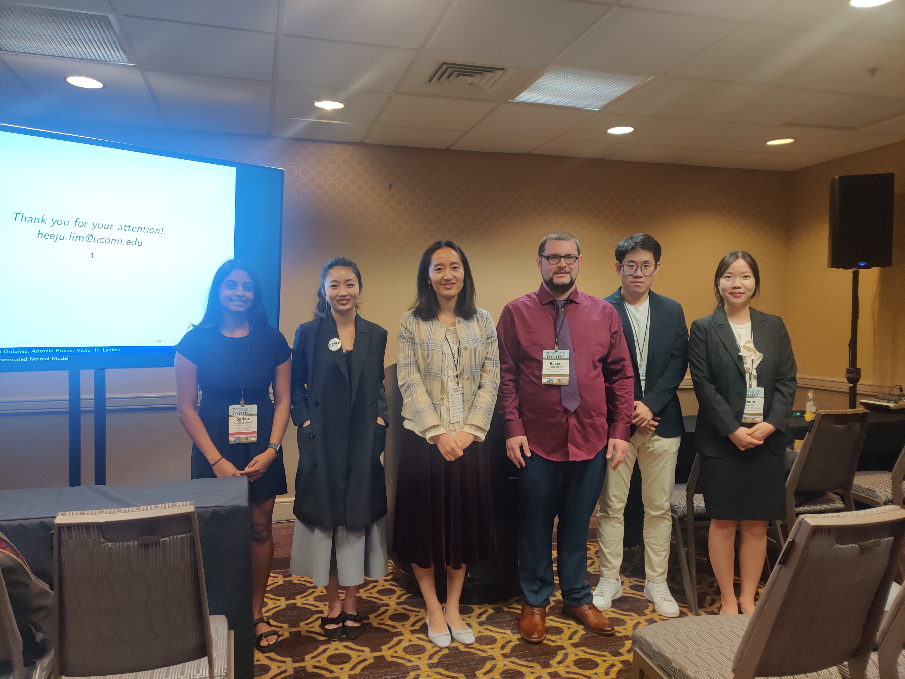
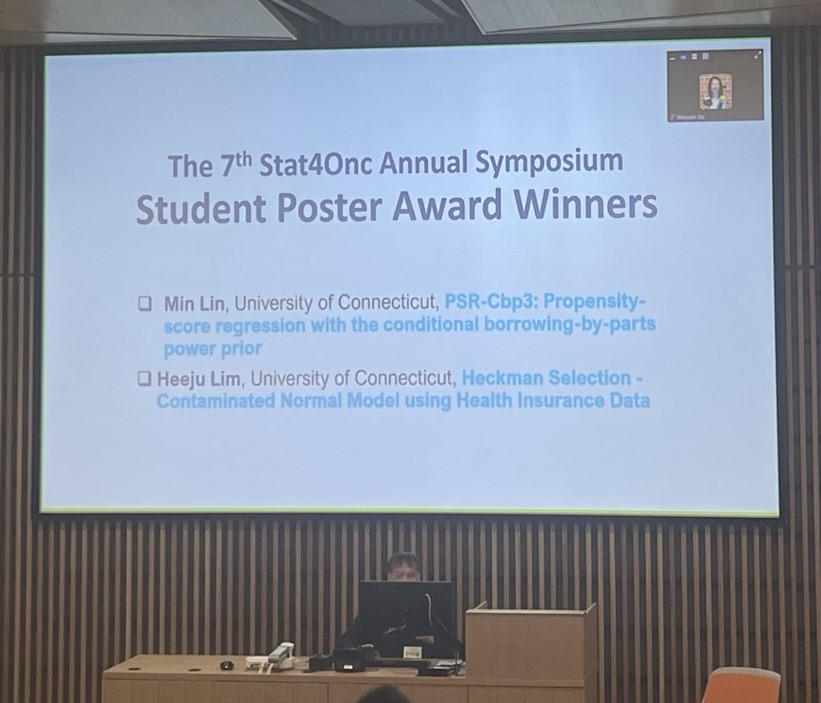
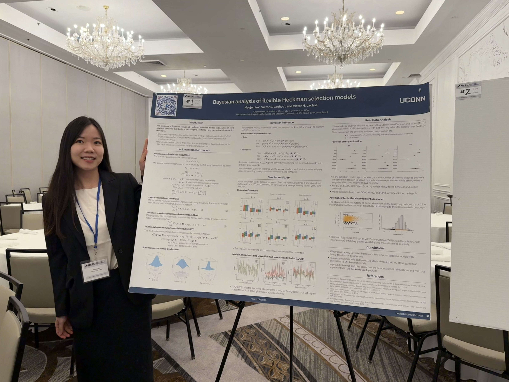
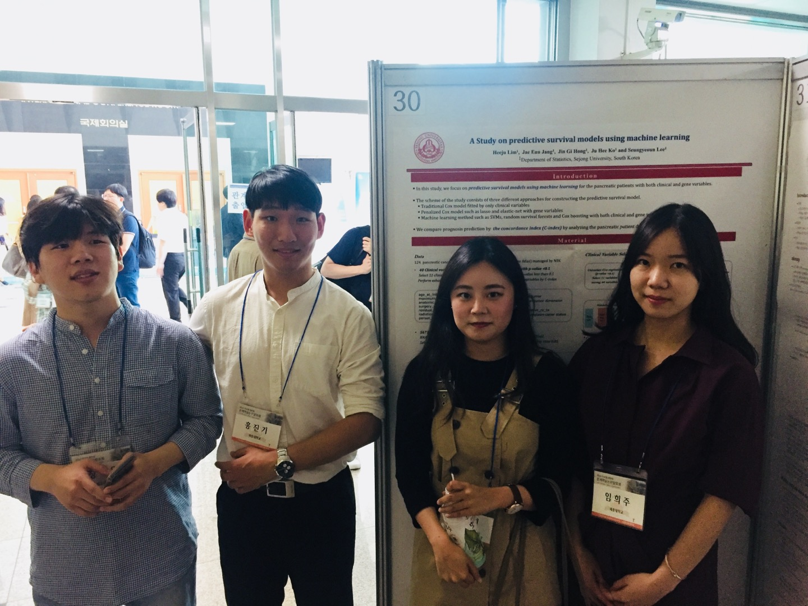

:::::: hero

# Heeju Lim {#about}

::: subtitle
Ph.D. in Statistics
:::

::: social-links
<a href="mailto:heeju.lim@uconn.edu"> <i class="fa-solid fa-envelope"></i> Email </a>

<a href="https://www.linkedin.com/in/heeju-lim-283382292/"> <i class="fa-brands fa-linkedin"></i> LinkedIn </a>

<a href="https://github.com/heeju-lim"> <i class="fa-brands fa-github"></i> GitHub </a>

<a href="https://www.researchgate.net/profile/Heeju-Lim"> <i class="fa-brands fa-researchgate"></i> ResearchGate </a>

<a href="https://scholar.google.com/citations?user=_ZbsHrwAAAAJ&hl"> <i class="fa-brands fa-googlescholar"></i> Google Scholar </a>
:::

::: about-card
I recently earned my Ph.D. in Statistics from the University of Connecticut under the supervision of Professor Victor Hugo Lachos. My research interests include Bayesian statistics, missing data analysis, sample selection models, multivariate analysis, and statistical computing.
:::
::::::

------------------------------------------------------------------------

# Education

### 🎓 Ph.D. in Statistics

**University of Connecticut** · 2019–2021, 2023–2026

[Advisor:]{style="color:#5C6BC0;"} Victor Hugo Lachos

### 🎓 M.S. in Statistics

**Korea University** · 2015 – 2017

[Advisor:]{style="color:#5C6BC0;"} Yousung Park

### 🎓 B.S. in Statistics

**Sejong University** · 2010 – 2015

[Advisor:]{style="color:#5C6BC0;"} Seungyeoun Lee

------------------------------------------------------------------------

# Publications {#publications}

::: pub-card
## Multiple Heckman Selection Model

**Heeju Lim**, Carlos A. R. Diniz, Ofer Harel, Victor H. Lachos

*Preprint* · May 2026

<a href="https://arxiv.org/abs/2605.01713" class="btn-pub">Preprint</a> <a href="https://github.com/heeju-lim/mvHeckman" class="btn-pub">R</a>
:::

::: pub-card
## Bayesian analysis of heavy-tailed Heckman selection models using Hamiltonian Monte Carlo

**Heeju Lim**, Victor E. Lachos, Victor H. Lachos

*Computational Statistics* · February 2026

<a href="https://link.springer.com/article/10.1007/s00180-026-01717-7" class="btn-pub">Article</a> <a href="https://arxiv.org/abs/2510.20942" class="btn-pub">Preprint</a> <a href="https://github.com/heeju-lim/Heckmanstan" class="btn-pub">R</a>
:::

::: pub-card
## Heckman Selection-Contaminated Normal Model

**Heeju Lim**, Jose Ordonez, Antonio Punzo, Victor H. Lachos

*Journal of Computational and Graphical Statistics* · February 2026

<a href="https://www.tandfonline.com/doi/full/10.1080/10618600.2025.2576165" class="btn-pub">Article</a> <a href="https://arxiv.org/abs/2409.12348" class="btn-pub">Preprint</a> <a href="https://github.com/marcosop/HeckmanEM" class="btn-pub">R</a>
:::

::: pub-card
## Review of Statistical Methods for Survival Analysis Using Genomic Data

Seungyeoun Lee, **Heeju Lim**

*Genomics & Informatics* · 2019

<a href="https://genominfo.org/journal/view.php?doi=10.5808/GI.2019.17.4.e41" class="btn-pub">Article</a>
:::

------------------------------------------------------------------------

# Presentations {#presentations}

### **Heckman Selection Contaminated Normal Model**

- **Contributed Session** \| ENAR 2025 Spring Meeting. *New Orleans, USA*, March 2025

- **Poster Winner** \| The 7th Stat4Onc Annual Symposium. *Connecticut, USA*, May 2024

- **Student Session** \| The 37th New England Statistics Symposium. *Connecticut, USA*, May 2024

### **Bayesian Analysis of Flexible Heckman Selection Models**

- **Invited Session** \| 2025 ICSA Applied Statistics Symposium. *Connecticut, USA*, June 2025

- **Poster** \| The 38th New England Statistics Symposium. *Connecticut, USA*, May 2025

- **Poster** \| DahShu Data Science Symposium. *Connecticut, USA*, October 2025

### **Study on Predictive Survival Models using Machine Learning**

- **Poster** \| The Korean Statistical Society conference. *Chuncheon, South Korea*, May 2019

------------------------------------------------------------------------

# Teaching Experience {#teaching}

::: teaching-highlight
<h3>Discussion Instructor</h3>

**Elementary Concepts of Statistics (STAT 1000Q)**

Fall 2024 · Spring 2025 · Fall 2025

<a href="/images/Syllabus_STAT1100Q_SEC033D_wed.pdf" class="btn-teach"> 📄 Syllabus </a>

:::

:::::: teaching-grid
::: teaching-school
### University of Connecticut

**Teaching Assistant**

-   Applied Spatio-Temporal Statistics *(Fall 2025)*
-   Linear Models I *(Fall 2024)*
-   Introduction to Mathematical Statistics II *(Spring 2021)*
-   Introduction to Mathematical Statistics I *(Fall 2020)*
:::

::: teaching-school
### Sejong University

**Teaching Assistant**

-   Bayesian Statistics *(Fall 2018)*
-   Mathematical Statistics II *(Fall 2014)*
:::

::: teaching-school
### Korea University

**Teaching Assistant**

-   Introduction to Database (SQL) *(Fall 2015)*
-   Introduction to C Programming *(Spring 2015)*
:::
::::::

------------------------------------------------------------------------

# <a href="/images/CV_HeejuLim_202606.pdf" class="cv-button">Curriculum Vitae</a> {#cv}
