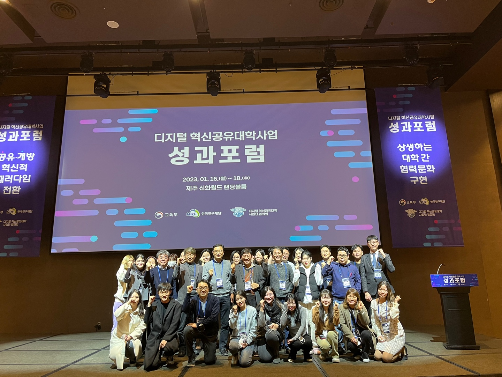
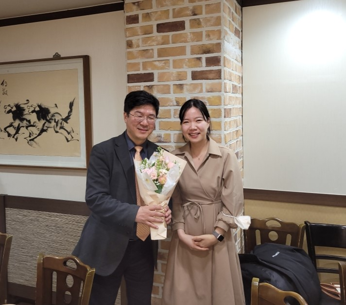
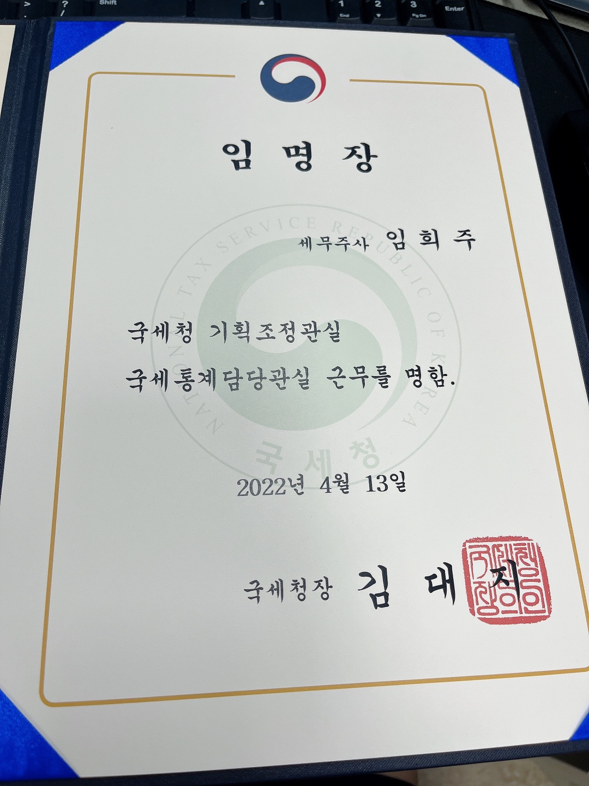
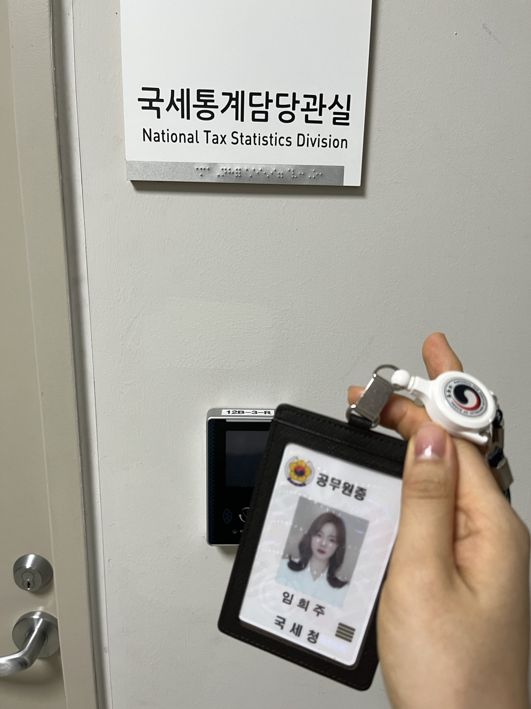
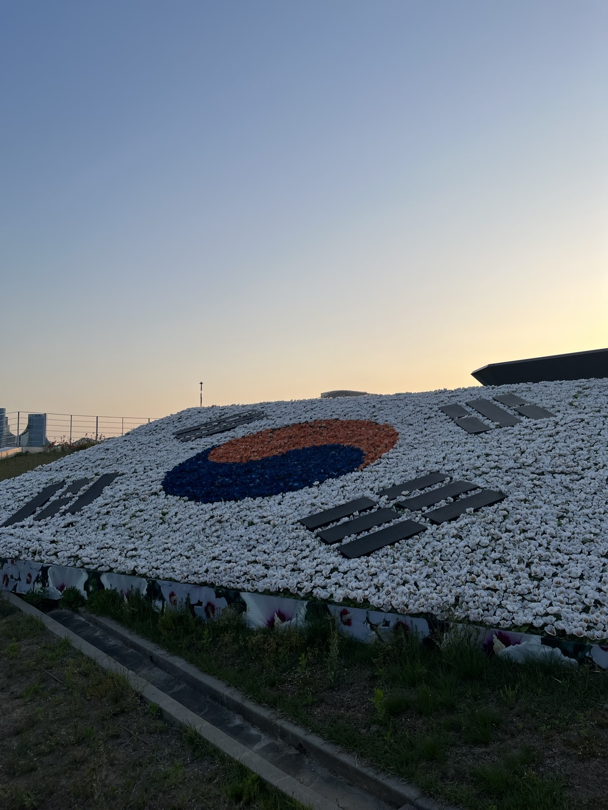
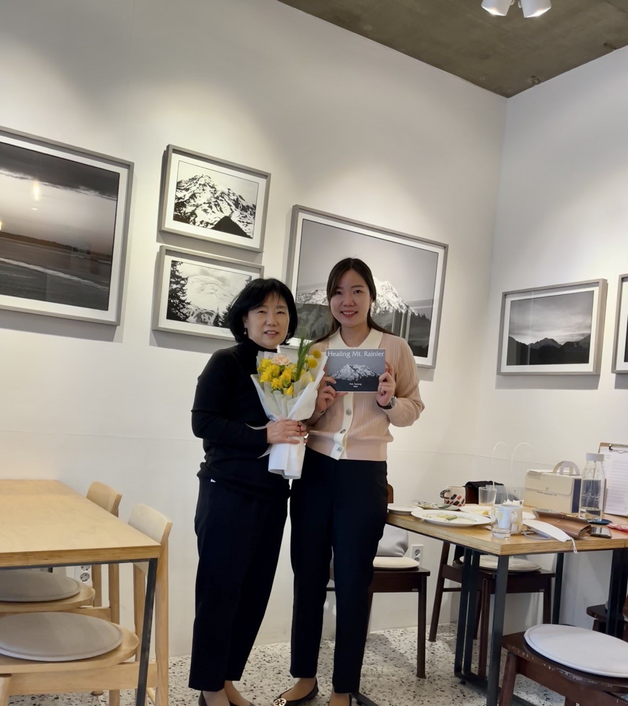

## **Work and Research Experience**

::: {.callout-caution icon="false"}
## []{style="color:crimson"} **Data Scientist, Korea University**

[]{style="color:crimson"} Oct 2022 - March 2023\
[]{style="color:crimson"} Department of Convergence and Open Sharing System for New Energy Industry

Developed a course-recommender system and the student-activity prediction modeling based on machine learning and deep learninng algorithms and Natural Language Processing
:::

{width="360" height="273"}{width="310"}

::: {.callout-warning icon="false"}
## []{style="color:peru"} **Statistician, National Tax Service of the Republic of Korea**

[]{style="color:peru"} Apr 2022 - Sep 2022\
[]{style="color:peru"} Department of National Tax data
:::

{width="220"} {width="220"} {width="220"}

::: {.callout-note icon="false"}
## []{style="color:blue"} **TA & Webmaster, University of Connecticut**

[]{style="color:blue"} Aug 2019 - May 2021\
[]{style="color:blue"} Department of Statistics and [New England Statistical Society(NESS)](https://nestat.org/about/it-team/)

Organized [the 4th Stat4Onc Annual Symposium](https://events.stat4onc.org/stat4onc2021/)

NextGen : [Data Science Day(2020)](https://nestat.org/nextgen/dsd2020/) and  [NextGen : Data Science Day(2019)](https://nestat.org/nextgen/dsd2019/) 
:::

::: {.callout-caution icon="false"}
## []{style="color:red"} **Researcher, Sejong University**

[]{style="color:red"} Sep 2018 - Jun 2019\
[]{style="color:red"} Biostatistics laboratory
:::

{width="266"} {width="400"}

::: {.callout-tip icon="false"}
## []{style="color:green"} **Data Analyst, DATASOLUTION inc. - Formerly SPSS Korea**

[]{style="color:green"} Mar 2017 - Sep 2017\
[]{style="color:green"} Department of Consulting Business HQ
:::

```{r}

```
